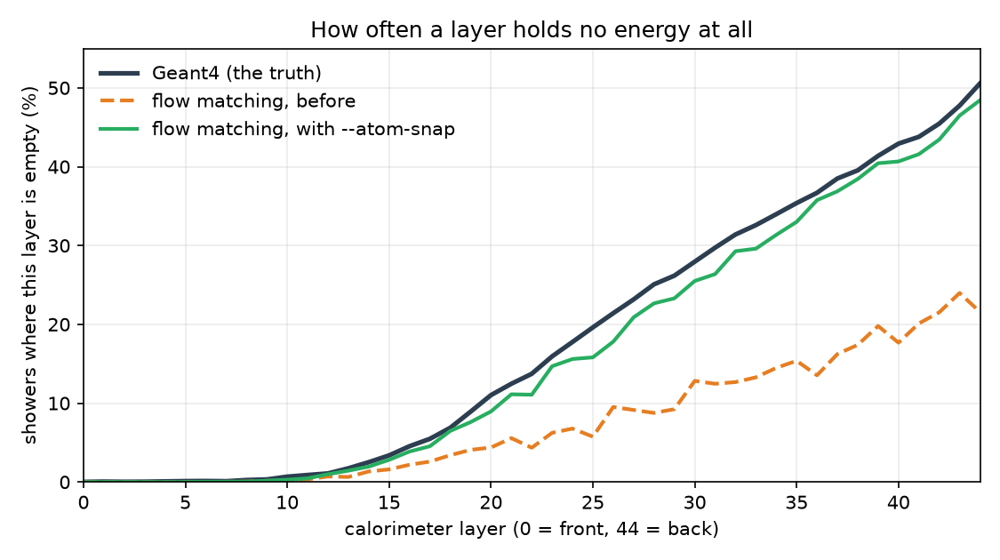

# PINNDE: Fast Calorimeter Simulation with Conditional Flow Matching | GSoC 2026

## Project Description

Simulating particle showers in a calorimeter with Geant4 is accurate and slow,
and it uses a large share of the computing budget in high energy physics. The
goal of this project is a generative model that produces showers of the same
quality in milliseconds, together with the measuring equipment needed to decide
whether the result is actually good enough to use.

This is the **flow matching track** of PINNDE. The model learns a velocity
field by regressing onto straight line paths from noise to data, and generates
by integrating an ODE. It is conditioned on the incident particle energy, so it
learns a family of distributions rather than one. The evaluation module here was
written so that any generative model on this data can be scored the same way.

Data is [CaloChallenge 2022](https://calochallenge.github.io/homepage/) dataset
2: two files of 100,000 showers, 6,480 detector cells each, with incident
energies from 1 GeV to 1 TeV.

## What was accomplished

As part of GSoC 2026 I worked on this project with
[ML4SCI](https://ml4sci.org/), under the mentorship of Prof. Harrison Prosper,
Prof. Pushpalatha Bhat and Prof. Sergei Gleyzer, within the GENIE initiative.

- Built `pinnde_eval`, a three tier evaluation module: cheap monitors to run
  inside a training loop, the CaloChallenge's own classifier AUC, chi squared
  and separation power, and distribution distances with error bars.
- Measured what a **perfect** generator scores, so that no number in the
  project is ever compared against zero, and established that the floor must be
  matched in incident energy for a conditional model.
- Moved the generator onto the challenge's own 362 high level features,
  computed with their code and checked against their own function to a relative
  tolerance of 1e-12.
- Found and fixed the model's largest failure, which turned out to be a
  question of representation rather than capacity: an empty calorimeter layer is
  an exact value, a continuous density can never produce an exact value, and the
  model reproduced empty layers 0.0% of the time. The fix moved chi squared from
  50.7 to 11.7 times the Geant4 floor over five seeds, at no computational cost.
- Added a different kind of check that asks whether a single generated shower
  could exist at all, which found defects no distribution metric had seen.
- Tested my own claims at the end of the program and corrected three of them,
  including the explanation for why the classifier score had not improved.

## Results

| | before | after |
|---|---|---|
| chi squared, as a multiple of the Geant4 floor | 50.7 ± 3.4 | **11.7 ± 2.3** |
| separation power, as a multiple of the floor | 52.8 ± 3.5 | **11.1 ± 2.3** |
| classifier AUC | 0.909 ± 0.017 | 0.894 ± 0.020 |
| showers containing a negative width | 72.6% | **4.8%** |
| showers with an inconsistent empty layer | 49.9% | **0.03%** |

Five seeds of each configuration. The classifier AUC did not move, and
[section 6 of the report](FINAL_REPORT.md) covers what I found when I tested my
own explanation for that, which turned out to be wrong.



## Documents

- **[Final report](FINAL_REPORT.md)** — what was built, what was found, what
  does not work yet, and how to reproduce it. Also as
  [Word](GSoC_2026_Final_Report_Tina.docx).
- **[Development log](pinnde_eval/DEVLOG.md)** — the full record, 30 sections,
  including the measurements that contradicted things I believed earlier.
- **[Package guide](PACKAGES.md)** — API and usage for both packages.
- **[Midterm report](GSoC_2026_Midterm_Report_Tina.docx)**
- Standalone repository with the same code:
  <https://github.com/aenorhabditis6/gsoc-2026-ml4sci-pinnde>

## Running it

The dataset is not in this repository. `cluster/get_data.sh` downloads it from
[Zenodo](https://zenodo.org/records/6366271) and verifies the checksums. Tests
that need the data skip themselves when it is absent.

```bash
pip install -r requirements.txt
OPENBLAS_NUM_THREADS=1 python -m pytest pinnde_eval/tests flow_matching/tests -q
```

171 tests pass. The recommended configuration, about three minutes on an
RTX 5090:

```bash
OPENBLAS_NUM_THREADS=1 python -m flow_matching.demo_calo --features official \
    --device cuda --hidden 1024 --depth 8 --steps 100000 --clip-grad 1.0 --atom-snap
```

`OPENBLAS_NUM_THREADS=1` is not optional: without it the classifier busy waits
and a nine second evaluation looks like a thirty minute hang.

## Next steps

1. Explain the rank Gaussian result. It is the only measurement here whose
   cause is unknown, and it decides which metric the project should optimise.
2. Bound the voxel model's output, so that generating the 6,480 raw cells
   becomes usable. That is the path to numbers directly comparable with
   published CaloChallenge submissions, which generate voxels rather than
   summaries.
3. Compare against those published submissions, which is now possible because
   our numbers are in their feature space, computed with their code, and quoted
   against measured floors.
